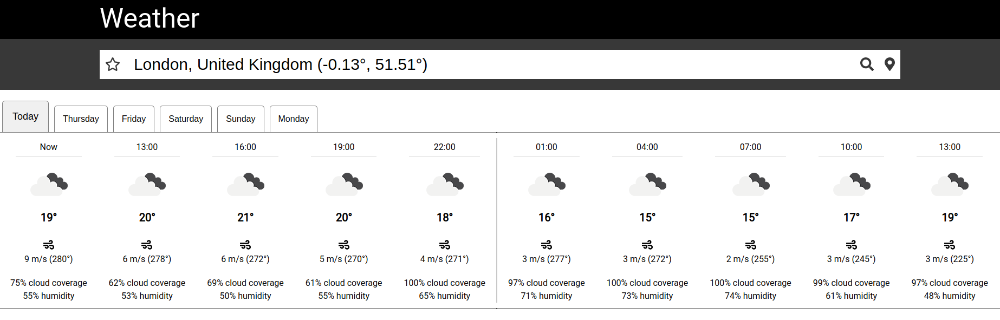

# Weather app



This app uses the [OpenWeatherMap API](https://openweathermap.org/api) to provide a five day weather forecast for any one of thousands of locations around the world.

My motivation for this project was to utilise a third part API, learn to use Redux and Styled COmponents, and for it to be front end focused. As I discuss later, I ended up having to implement a small backend server anyway.

Key features:

- location autocomplete based on text typed into search box so far
- find the weather at your current location
- choose a default location that shows its weather when you load the page
- responsive design with draggable forecast view on touchscreen devices
- backend server to provide responsive lists of locations based on user input

## Technologies used

| Purpose   | Technology                                                           |
| :-------- | :------------------------------------------------------------------- |
| Language  | JavaScript                                                           |
| Front end | React with functional components and hooks, Redux, Styled Components |
| Back end  | Express                                                              |
| Testing   | Jest, React Testing Library (front end), Jest, Supertest (back end)  |
| CI/CD     | Circle CI, Netlify (front end), Heroku (back end)                    |

## Getting started

The project has two repositories. You are currently looking at the front end repository, and the back end can be found at:

- https://github.com/PhilipVigus/weather-app-server

Both of these are required to run the project locally.

```bash
# clone the repositories to your local machine with either
# if you're using ssh
git clone git@github.com:PhilipVigus/weather-app.git
git clone git@github.com:PhilipVigus/weather-app-server.git

# if you're using https
git clone git@github.com:PhilipVigus/weather-app.git
git clone git@github.com:PhilipVigus/weather-app-server.git

# install project dependencies in each repository's root folder
yarn install
```

### Starting the app locally

Assuming everything is set up as specified above, you can start the app as follows:

```bash
# back end root folder
# this command starts the server using nodemon, which means whenever you make changes to the server code, the server will be restarted to reflect the changes
yarn watch:dev

# front end root folder
yarn start
```

## Testing

```bash
# back or front end root folder
# interactive
yarn test
```

## My approach

### User stories

```
As a user,
So that I can see what weather different places is experiencing
I want to see the current weather at the location I choose

As a user,
So that I can plan what I'm going to do in the future
I want to see the weather forecast at the location I choose

As a user,
So that I don't have to repeatedly type stuff in
I want to be able to set a default location

As a user,
So that I can see the weather forecast for where I am right now
I want to be able to set the forecast based on my device's location
```

### Design decisions

#### The front end

My prime focus for the front end was learning to use Redux and Styled Components. I consider the project a success in this regard. Redux is used for all global state management, including retrieving data from the third party API and back end server, while Styled Components are used for all css styling.

Implementing the location search box was particularly challenging due to the sheer number of locations (200k+) available. Although I initially attempted to keep this all on the front end, working with such a large amount of data made the intiial load time for the site far too slow. My solution was to implement a small back end server to serve the data to the front end as and when required.

In general I am extremely happy with the end result of the front end, which looks clean and professional, and makes good use of Redux and Styled components.

I am particularly pleased with the scrollable forecast view and the responsiveness of the location search bar.

#### The back end

As already commented, I originally intended the project to be front end only. However, implementing the location search functionality required a simple server to serve the locations to appear in the search box as the user types. Without this, the site load times and general responsiveness were very sluggish.

I investigated a number of possible implementations, ranging from a full-blown database through to simply serving individual files split by the location initial letters. I settled on the latter idea, as it was by far the simplest and met my needs. It worked very well, allowing the front end to respond quickly to user input when searching for locations.

## Further work

- At present the default location is kept in local storage. If this is unavailable or the user does not allow access then the feature simply doesn't work. A possible solution to this would be to use cookies as a backup.
- The location data provided by the third party API contains a number of duplicates, where latitude and longitude are either identical or extremely close together. A possible solution to this would be to preprocess the data further, removing these duplicates.
- There are a number of graphical improvements that could be made, particularly to the scrollable view. It would nice to include an element that indicated the warmth on a colour scale for example. There is also other forecast data I am not displaying that could be integrated into the display.
- I would like to implement some kind of tooltips for the buttons on the page.
